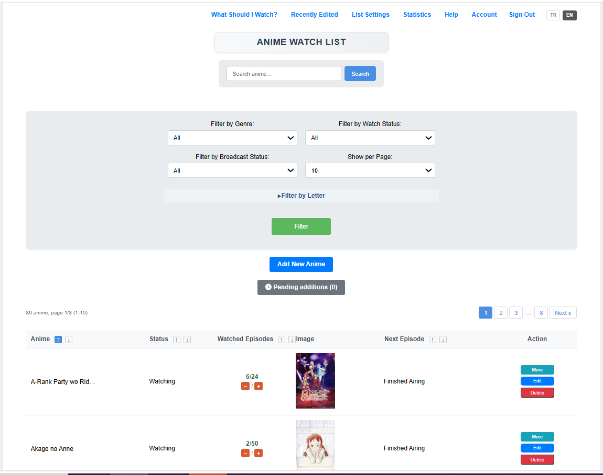
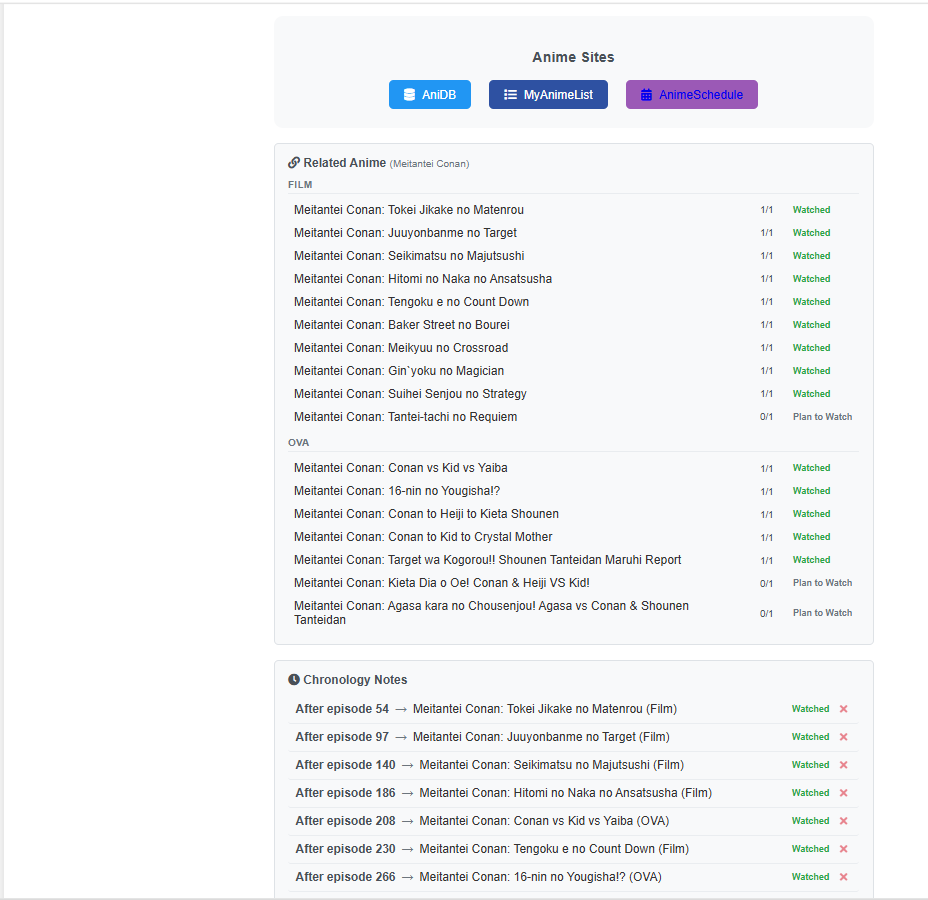
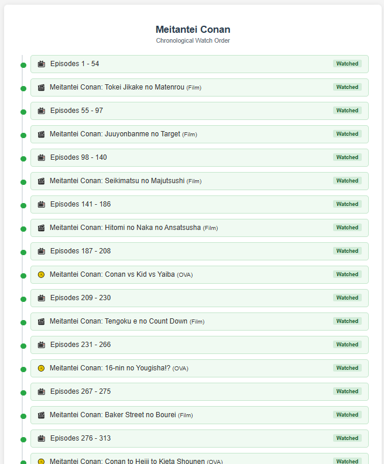
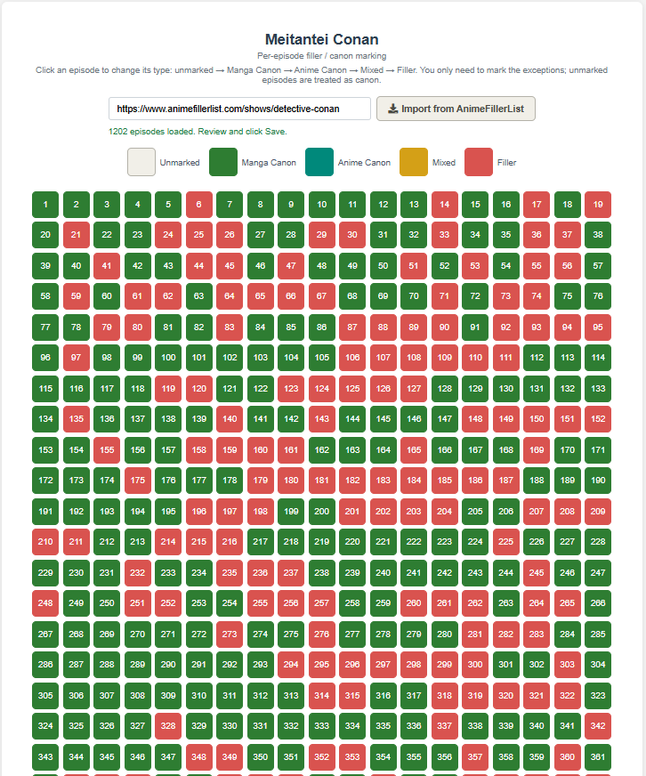
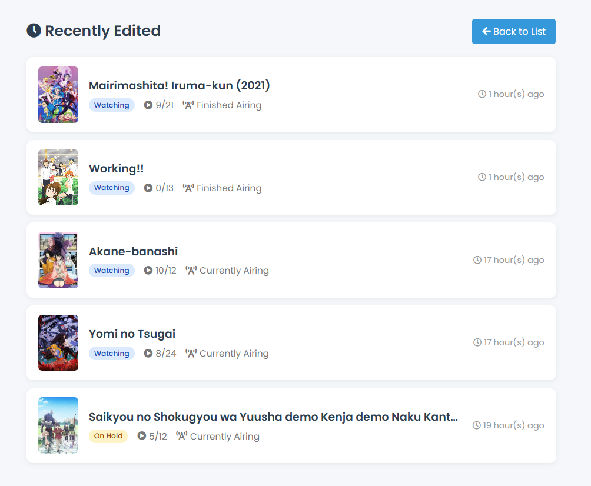

<p align="center">
  
</p>

<h1 align="center">Anime Tracker</h1>

<p align="center">
  Türkçe-öncelikli, açık kaynak anime takip uygulaması —
  self-host (tek kullanıcı) veya online (çok kullanıcı) çalışır.<br>
  <i>An open-source, Turkish-first anime tracker — runs self-hosted (single user)
  or online (multi-user).</i>
</p>

<p align="center">
  <a href="https://animetracker.uzakdiyarlar.com/"><b>Canlı Demo / Live Demo</b></a> ·
  <a href="https://github.com/hitsumo/animetracker/releases">Sürümler / Releases</a> ·
  <a href="https://www.sicakcikolata.com">sicakcikolata.com</a> ·
  <a href="#türkçe">Türkçe</a> ·
  <a href="#english">English</a>
</p>

<p align="center">
  <a href="LICENSE.txt"></a>
  
  
  
</p>

<!-- Ekran goruntuleri / Screenshots: docs/screenshots/ altina koy -->
<p align="center">
  
  
  
  
  
  
</p>

---

## Türkçe

Sıradan bir listeden fazlası: büyük servislerde (MyAnimeList, AniList, Kitsu)
bulunmayan **izleme sırası (kronoloji)**, **filler takibi** ve **duygu işaretleri**
gibi özellikleri tek araçta toplar. Verisi sende kalır; bulutta bir hesaba bağımlı
değilsin.

> Listeye **kişisel not ekleme** özelliği bu projenin çıkış noktasıydı. :)

### Özellikler

- **Liste ve takip:** anime ekle/düzenle, izleme durumu (İzleniyor, Tamamlandı,
  Bırakıldı, Beklemede, İzlenecek), izlenen bölüm sayısı.
- **MyAnimeList içe aktarma:** MAL'dan dışa aktardığın listeyi (XML) yükle;
  katalogda eşleşenler listene işlenir, eşleşmeyenler öneri/onaya düşer.
  (AniList içe aktarma planlanıyor.)
- **Kişisel notlar:** her animeye kendi notunu, kendi özetini/çevirini ekle.
- **Yayın takibi:** devam eden serilerin yeni bölüm tarihleri; yayın günü/saati
  (UTC saklanır, kendi saat dilimine çevrilir), AnimeSchedule entegrasyonu.
- **İzleme sırası / kronoloji:** seri içi izleme sırasını işaretle ("şu bölümden
  sonra şu filme geç" gibi) — hangi sırayla izleneceğini gösterir.
- **Filler takibi:** filler bölümleri işaretle ve gör.
- **Duygu işaretleri:** puan değil, ruh hali — anime başına 3'e kadar (Güldürdü,
  Hüzünlendirdi, Heyecanlandırdı, Korkuttu, Düşündürdü, Şaşırttı, Dinlendirdi,
  Motive Etti, Sıktı).
- **Tür ve etiket yönetimi**, öneri sistemi, istatistikler.
- **Türkçe-öncelikli içerik:** kataloğun konuları özgün Türkçe yazılır; kişi
  tarafından yapılan çeviri eklenene kadar İngilizce sürüm "Auto-translated from
  Turkish" etiketiyle gösterilir.
- **İki dilli arayüz (TR/EN)** ve başlık dili tercihi.

### İki çalışma modu

Aynı kod tabanı, `MULTI_USER_MODE` ayarıyla iki şekilde çalışır:

| | Self-host (tek kullanıcı) | Online (çok kullanıcı) |
|---|---|---|
| Giriş | Yok | Kayıt + giriş, roller (admin / moderatör / üye) |
| Veri | Tamamen sende, yerel | Sunucuda, kullanıcı başına; kendi listeni (izleme durumu, notlar, duygular) istediğin an dışa aktarabilirsin (JSON) |
| Katalog | Merkez katalogdan çekilir | Merkez katalogdan çekilir; üye eklemeleri önce onaya düşer, yalnızca onaylananlar merkeze gönderilir (onaylanmayanlar o kurulumda kalır) |
| Kurulum | Windows .exe / Docker / manuel | Docker / sunucu |

> Self-host davranışı her zaman korunur; online özellikleri yalnızca
> çok-kullanıcı modunda devreye girer.

### Kurulum

**1) Windows (.exe) — en kolay, self-host**

[Bu bağlantıdan `.exe`'yi indir](https://drive.proton.me/urls/XQ92P0KM3R#tzPRSMRrUrCB)
ve çalıştır. Kurulum, gerekli XAMPP'ı kurar, Apache + MySQL'i
başlatır ve veritabanı + site dosyalarını oluşturur. Bittiğinde tarayıcıdan
`http://localhost/anime_tracker/` adresine git.

*Windows SmartScreen:* Uygulama imzalı olmadığı için "Windows protected your PC"
görebilirsin; normaldir. "More info" → "Run anyway" ile devam et.

**2) Docker — online ya da self-host**

`.env` dosyasını `.env.example`'dan oluştur. Online (çok kullanıcı) için:

```env
MULTI_USER_MODE=true
ADMIN_USER=adminkullanici
ADMIN_PASS=enaz8karakter
```

Sonra `docker compose up -d`. `MULTI_USER_MODE` verilmezse self-host (girişsiz)
çalışır. İlk admin yalnızca ilk açılışta, verdiğin bilgilerle oluşturulur.

**3) Manuel (XAMPP / LAMP)**

1. `AnimeTracker/files/` içeriğini web kök dizinine (`htdocs/anime_tracker/`) kopyala.
2. `config_example.php`'yi `config.php` olarak kopyalayıp veritabanı bilgilerini gir.
3. `http://localhost/anime_tracker/` adresine git; kurulum sihirbazı şemayı yükler.

### Katalog modeli

Animelerin meta verisi (başlık, konu, linkler, kronoloji) küratörlü bir **merkez
katalogdan** gelir. Self-host ve online kurulumlar bu katalogu çeker; online
kurulumda bir yönetici bekleyen bir animeyi onayladığında kayıt merkeze otomatik
geri gönderilir (imzalı, sunucudan sunucuya) ve diğer kurulumlar bir sonraki
güncellemede alır. Kişisel veriler (izleme durumu, notlar, duygular) asla katalogla
paylaşılmaz — yalnızca liste dışa/içe aktarmayla taşınır.

### Teknoloji ve lisans

PHP · MariaDB / MySQL · vanilla JavaScript · XAMPP veya Docker.
Lisans: [GPL-2.0](LICENSE.txt). Yapay zekâ kullanımı için bkz.
[AI_NOTICE.md](AI_NOTICE.md).

---

## English

More than a plain list: it brings together features the big services (MyAnimeList,
AniList, Kitsu) lack — **watch order (chronology)**, **filler tracking**, and
**emotion marks** — in one tool. Your data stays with you; you are not tied to a
cloud account.

> The ability to add **personal notes** to a list is what started this project. :)

### Features

- **List and tracking:** add/edit anime, watch status (Watching, Completed,
  Dropped, On-Hold, Plan to Watch), watched-episode count.
- **MyAnimeList import:** upload your exported MAL list (XML); matches are written
  to your list, misses go to suggestions/approval. (AniList import planned.)
- **Personal notes:** add your own note, your own summary/translation per anime.
- **Airing tracking:** next-episode dates for ongoing series; broadcast day/time
  (stored in UTC, shown in your timezone), AnimeSchedule integration.
- **Watch order / chronology:** mark the in-series viewing order ("after this
  episode, watch this movie") so the right order is clear.
- **Filler tracking:** mark and see filler episodes.
- **Emotion marks:** not a score, a mood — up to 3 per anime (Made me laugh, Made
  me sad, Excited me, Scared me, Made me think, Surprised me, Relaxed me, Motivated
  me, Bored me).
- **Genre and tag management**, recommendations, statistics.
- **Turkish-first content:** catalog synopses are written natively in Turkish;
  until a human translation is added, the English version is shown with an
  "Auto-translated from Turkish" label.
- **Bilingual UI (TR/EN)** and a title-language preference.

### Two modes

The same codebase runs two ways via `MULTI_USER_MODE`:

| | Self-host (single user) | Online (multi-user) |
|---|---|---|
| Login | None | Sign-up + sign-in, roles (admin / moderator / member) |
| Data | Entirely yours, local | On the server, per user; you can export your own list (watch status, notes, emotions) anytime (JSON) |
| Catalog | Pulled from the central catalog | Pulled from it; member additions go through approval, only approved ones are pushed back (the rest stay on that install) |
| Install | Windows .exe / Docker / manual | Docker / server |

> Self-host behavior is always preserved; online features only activate in
> multi-user mode.

### Installation

**1) Windows (.exe) — easiest, self-host**

[Download the `.exe`](https://drive.proton.me/urls/XQ92P0KM3R#tzPRSMRrUrCB) and run
it. The installer sets up the required XAMPP, starts Apache + MySQL, and creates the
database and site files. When done, open `http://localhost/anime_tracker/`.

*Windows SmartScreen:* Because the app is unsigned you may see "Windows protected
your PC"; this is expected. Click "More info" → "Run anyway".

**2) Docker — online or self-host**

Create `.env` from `.env.example`. For online (multi-user):

```env
MULTI_USER_MODE=true
ADMIN_USER=adminuser
ADMIN_PASS=atleast8chars
```

Then `docker compose up -d`. Without `MULTI_USER_MODE` it runs self-host (no login).
The first admin is created only on first start, from the values you provide.

**3) Manual (XAMPP / LAMP)**

1. Copy the contents of `AnimeTracker/files/` into your web root
   (`htdocs/anime_tracker/`).
2. Copy `config_example.php` to `config.php` and fill in the database details.
3. Open `http://localhost/anime_tracker/`; the setup wizard loads the schema.

### Catalog model

Anime metadata (title, synopsis, links, chronology) comes from a curated **central
catalog**. Self-host and online installs pull from it; in online mode, when an admin
approves a pending anime, the record is automatically pushed back to the central
server (signed, server-to-server) and other installs receive it on their next
update. Personal data (watch status, notes, emotions) is never shared with the
catalog — it only moves via list export/import.

### Tech and license

PHP · MariaDB / MySQL · vanilla JavaScript · XAMPP or Docker.
License: [GPL-2.0](LICENSE.txt). For the use of AI in building this project, see
[AI_NOTICE_EN.md](AI_NOTICE_EN.md).
